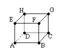
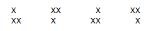

#[2025. Line Fighting](https://acm.timus.ru/problem.aspx?space=1&num=2025&locale=en)
* Time limit: 1.0 second
* Memory limit: 64 MB

Boxing, karate, sambo… The audience is sick of classic combat sports. That is why a popular sports channel launches a new competition format based on the traditional Russian entertainment called line fighting. There can be from 2 to k teams taking part in a competition, and there are n fighters altogether in all the teams. Before the competition starts, the fighters are divided into teams: each fighter becomes a member of exactly one team. Two fighters fight each other if they are members of different teams. The organizers believe that the more the number of fights between fighters, the higher the popularity of a competition will be. Help the organizers to distribute fighters between teams so as to maximize the number of fights and output this number.
####Input
The first line contains the number of tests T (1 ≤ T ≤ 10). In each of the following T lines you are given a test: integers n and k separated with a space (2 ≤ k ≤ n ≤ 104).
####Output
For each test output the answer (one integer) in a separate line.
####Sample
#####Input
```
3
6 3
5 5
4 2
```
#####Output
```
12
10
4
```
Problem Author: *Alexey Danilyuk*
Problem Source: *Ural Regional School Programming Contest 2014*


#[1005. Stone Pile](https://acm.timus.ru/problem.aspx?space=1&num=1005&locale=en)
* Time limit: 1.0 second
* Memory limit: 64 MB

You have a number of stones with known weights w1, …, wn. Write a program that will rearrange the stones into two piles such that weight difference between the piles is minimal.
####Input
Input contains the number of stones n (1 ≤ n ≤ 20) and weights of the stones w1, …, wn (integers, 1 ≤ wi ≤ 100000) delimited by white spaces.
####Output
Your program should output a number representing the minimal possible weight difference between stone piles.
####Sample
#####Input
```
5
5 8 13 27 14
```
#####Output
```
3
```
Problem Source: *USU Championship 1997*

#[1155. Troubleduons](https://acm.timus.ru/problem.aspx?space=1&num=1155&locale=en)
* Time limit: 1.0 second
* Memory limit: 64 MB


*Archangel of the Science is reporting:*

*“O, Lord! Those physicists on the Earth have discovered a new elementary particle!”*

*“No problem, we’ll add another parameter to the General Equation of the Universe.”*


As physics develops and moves on, scientists find more and more strange elementary particles, whose properties are more than unknown. You may have heard about muons, gluons and other strange particles. Recently scientists have found new elementary particles called troubleduons. These particles are called this way because scientists can create or annihilate them only in couples. Besides, troubleduons cause trouble to scientists, and that’s why the latter want to get rid of them. You should help scientists get rid of troubleduons.



Experimental set consists of eight cameras, situated in the vertices of a cube. Cameras are named as A, B, C, …, H. It is possible to generate or annihilate two troubleduons in neighbouring cameras. You should automate the process of removing troubleduons.
####Input
The only line contain eight integers ranging from 0 to 100, representing number of troubleduons in each camera of experimental set.
####Output
Output sequence of actions leading to annihilating all troubleduons or “IMPOSSIBLE”, if you cannot do it. Actions should be described one after another, each in a separate line, in the following way: name of the first camera, name of the second camera (it should be a neighborough to the first one), “+” if you create troubleduons, “-” if you destroy them. Number of actions in the sequence should not exceed 1000.
####Sample
#####Input
```
1 0 1 0 3 1 0 0 
```
#####Output
```
EF-
EA-
AD+
AE-
DC-
```
#####Input
```
0 1 0 1 2 3 2 2
```
#####Output
```
IMPOSSIBLE
```
Problem Source: *Ural Collegiate Programming Contest, April 2001, Perm, English Round*

#[1296. Hyperjump](https://acm.timus.ru/problem.aspx?space=1&num=1296&locale=en)
* Time limit: 1.0 second
* Memory limit: 64 MB

Developed in the beginning of XXI century, hyperjump remains the primary method of transportation for distances up to thousands parsecs. But physicists have recently discovered an amazing phenomenon. They believe the duration of the hyperjump alpha phase can be easily controlled. Alpha phase is the period when hyper-spacecraft accumulates its gravity potential. The larger is the gravity potential accumulated, the less energy is required to complete the hyperjump. Your task is to write a program, which would help pilots decide when to enter and when to leave the alpha-phase, in order for the hyperspacecraft to accumulate the largest possible gravity potential.

The most crude gravity field model (which you will have to use) yields the sequence of integers pi, which represent field intensities at different moments in time. According to this model, if the alpha-phase begins at moment i and ends at moment j, then the value of gravity potential accumulated will be equal to the sum of sequence elements at places from i-th to j-th inclusive.
####Input
The first line of the input contains an integer N being the number of elements in the intensity values sequence (0 ≤ N ≤ 60000). Next N lines specify sequence elements, each line containing a single integer pi (−30000 ≤ pi ≤ 30000).
####Output
The only line of output contains the largest possible value of the gravity potential that can be accumulated by a hyperspacecraft during the alpha phase. You should assume that the initial gravity potential of a hyperspacecraft is equal to zero.
####Sample
#####Input
```
10
31
-41
59
26
-53
58
97
-93
-23
84
```
#####Output
```
187
```
#####Input
```
3
-1
-5
-6
```
#####Output
```
0
```
Problem Author: *Den Raskovalov*
Problem Source: *IX Open Collegiate Programming Contest of the High School Pupils (13.03.2004)*

#[1401. Gamers](https://acm.timus.ru/problem.aspx?space=1&num=1401&locale=en)
* Time limit: 1.0 second
* Memory limit: 64 MB

Mr. Chichikov is a wealthy man. Besides other ways of earning the money he used this one: he argued with some blunderers that he would be able to prove that it is impossible to pave the 512 × 512 square checker-board with the figures:



and he always won. Once one of those blunderers happened to be not so silly and he claimed that he was able to pave the 512 × 512 square checker-board without the upper right cell with those figures. Chichikov blurted out that he could pave any 2^n × 2^n square checker-board without one arbitrary cell with those figures. One word led to another and they bet. Chchikov felt that he wouldn’t prove his case. Help him!
####Input
The first input line contains an integer n (1 ≤ n ≤ 9). The second line consists of two integers x and y — those are the coordinates of the deleted cell (1 ≤ x, y ≤ 2^n). x is a number of a row and y is a number of a column. The coordinates of the upper left cell of the board are (1, 1).
####Output
Your program is to output 2^n lines with 2^n numbers in each line. There must be 0 on the place of the deleted cell. On the other places there must be numbers from 1 to (2^(2n) − 1) / 3 — a number of figure that covers this cell. It is clear that equal numbers must form a figure. If such a coverage is impossible, output “−1”.
####Sample
#####Input
```
2
1 1
```
#####Output
```
0 1 3 3
1 1 4 3
2 4 4 5
2 2 5 5
```

Problem Author: *Alex Samsonov*
Problem Source: *The 12th High School Pupils Collegiate Programming Contest of the Sverdlovsk Region (October 15, 2005)*

